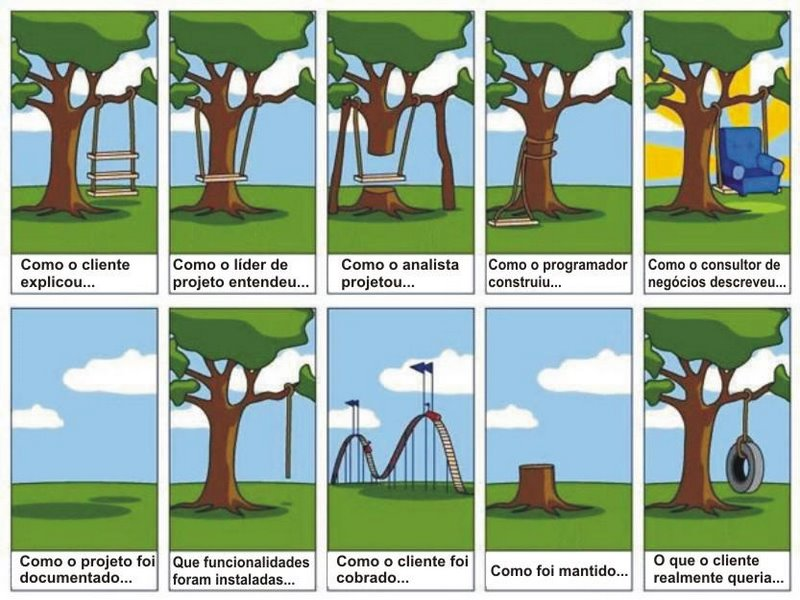

### [**Voltar para o Início**](https://github.com/2023-PROG-IFC/Programacao)

#### [**Página Anterior**](../01_03_desafios/)

# Hello, World!

***Requisitos para estar aqui:***
- Ter resolvido pelo menos os dois primeiros testes de raciocínio lógico!
- Caso não tenha resolvido ainda, [**CLIQUE AQUI**.](../01_02_desafios/)

Comecemos com algumas regras básicas. Para isso, apresentaremos um exemplo de programa para resolver o seguinte problema: *Acender um palito de fósforo!*

**Quais são as etapas necessárias para este programa?**

Comecemos com a seguinte sugestão de passos:

1. Pegar uma caixa de fósforo.
2. Abrir a caixa de fósforo.
3. Verificar se há palito de fósforo. Se houver:
   
   3.1. Retirar um palito.
   
   3.2. Fechar a caixa.

   3.3. Riscar o palito.

   3.4. Verificar se acendeu. Se SIM:

        3.4.1. OK! Problema resolvido!
   
   3.5. Se NÃO:
   
        3.5.1. Retornar ao passo (...?).
    
4. Descartar a caixa e retornar ao passo 1.

## Este seria quase todo o programa. Porém, o que falta é...

Para onde você imagina que o passo 3.5.1. deve retornar?
- Se retornar para o 3.1, ainda haverá palitos?
- Se retornar para o 3.3, quantas vezes tentará acender o palito?
- ***Na sua opinião, o correto seria voltar para qual passo?***

Considerando que o palito será descartado, o correto seria voltar para o **passo número 2!** Isso se deve ao fato de a caixa ter sido fechada logo após você retirar o palito (3.2).

A lógica para resolver o problema acima exige que sejam estruturados vários comandos sequenciais. Este problema será citado diversas vezes no futuro, pois abordará grande parte dos conceitos que serão ensinados ao longo do ano letivo, além da organização que deveremos ter ao codificar um programa para qualquer solução.

> Lembre-se que um computador nunca será mais inteligente que um humano! Um computador apenas segue uma sequência de tarefas definidas por um humano.

Para trabalhar com desenvolvimento de soluções para a área de Tecnologia da Informação, você deverá ter uma visão crítica, entendendo o problema de forma holística.

Caso contrário, você poderá vivenciar a seguinte situação:

Grande parte dos problemas estarão divididos em três etapas, já abordadas aqui: Entrada, Processamento e Saída.

# Entrada, Processamento e Saída

Um programa sempre deverá ter esta separação, que inclusive já foi abordada aqui anteriormente. O que são cada uma delas?
* Entrada: É quando algum dado é solicitado para o usuário. Este dado pode ser um Nome, uma Data de Nascimento, Idade, Salário, etc.
* Processamento: Logo após o(s) dado(s) ser(em) fornecido(s), eles serão processados, mediante a regra estabelecida, necessária para resolver o problema.
* Saída: A informação é apresentada para o usuário, mediante o problema apresentado. Veja: Estamos transformando dados em informações!

**Exemplo**: É solicitado que o usuário insira a sua data de nascimento. Após, o programa irá processar aquele dado fornecido e informará se o usuário é maior de idade ou não.

Para que a solução seja compreendida pelo computador, utilizamos algumas *Linguagens de Programação*. As Linguagens de Programação utilizam comandos, que, em grande parte, são específicos de cada linguagem. O conceito pode ser o mesmo, mas para executar o comando talvez não haja similaridade entre diferentes linguagens de programação.

Por exemplo, o comando para apresentar um texto qualquer para o usuário.
- Em PHP: Comando ***echo***;
- Em JavaScript: Comando ***alert***.

## Falando em JavaScript...

Vamos agora abordar a Linguagem que será utilizada durante toda a nossa jornada de Programação I, disciplina que será ministrada durante o ano letivo para as turmas de 1º Ano dos Cursos Técnicos em Informática do [Instituto Federal Catarinense - Campus Araquari](https://araquari.ifc.edu.br).

### [**<u>Próximo Passo: JavaScript</u>**](../01_05_JS/)