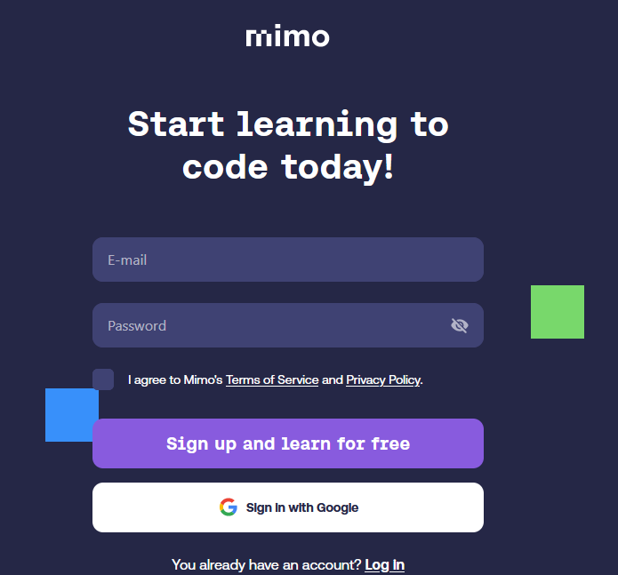
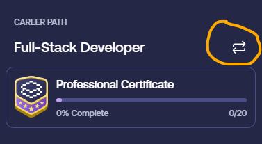
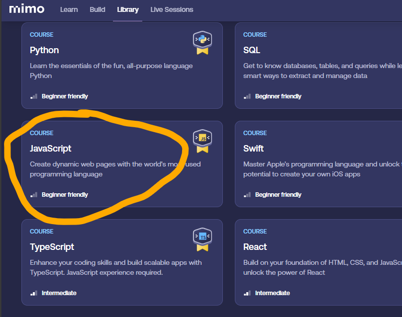
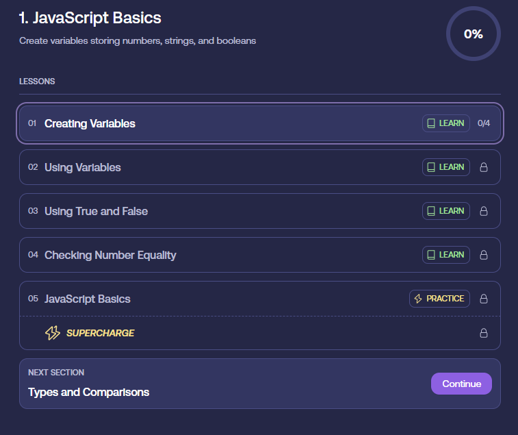
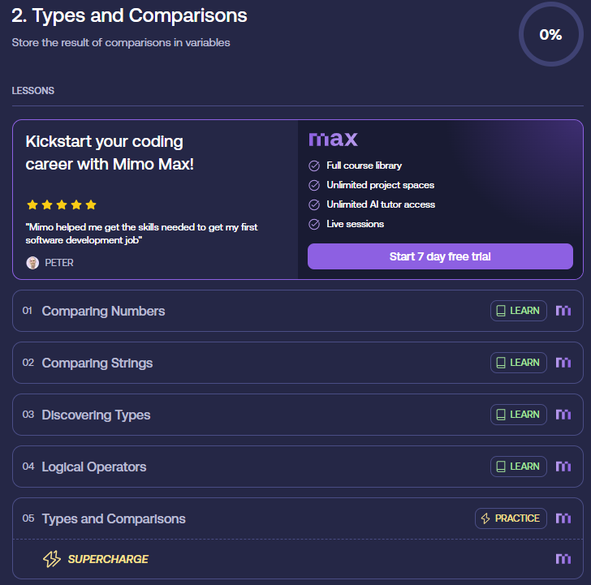

### [**Voltar para o Início**](../../README.md)

#### [**Página Anterior**](../01_05_JS/README.md)

# Certificação de Fundamentos de Programação

***Requisitos para estar aqui:***
- Ter lido a introdução de JavaScript.
- Caso não tenha lido ainda, [**CLIQUE AQUI**.](../01_05_JS/README.md)

Antes de começarmos a codificar, visando fortalecer os seus conhecimentos em Lógica de Programação, é **obrigatório** que você faça o primeiro e o segundo módulo do Curso de JavaScript, oferecido pelo [**MIMO**](https://mimo.org/).

Após acessar o link acima, clique em [**Sign up**](https://mimo.org/web/register) e crie a sua conta.

* Recomenda-se criar a conta no MIMO usando a sua Conta de e-mail do GMail.

Após a criação da conta, clique em **Continue**. Na próxima página, coloque o seu **NOME**! _Não utilize nomes que não o identificarão!_

Na próxima página, clique em **Sounds good**. Então o MIMO lhe perguntará o que o motiva a aprender a programar. Selecione a opção que mais lhe convém. Após, clique em **Continue**.

Então o MIMO lhe apresentará uma oferta para adquirir o plano Premium. Clique **Let me see the offer** e então clique no **X** que aparecerá no canto direito superior da sua tela. Então ele fará algumas outras perguntas para você.

Talvez o MIMO já lhe sugira algum curso. Porém, se isso acontecer, você poderá trocar o curso, clicando no ícone de **três linhas** no canto superior esquerdo da sua tela. Após, aparecerá duas setas que lhe permitirão trocar o curso. Clique nesta seta e selecione a opção JavaScript, que é possível acessar pelo link [**https://mimo.org/web/197/section/active**](https://mimo.org/web/197/section/active).

A troca de curso pode ser feita seguindo os passos das imagens abaixo:

A sua trilha de aprendizado no MIMO será a seguinte:
1.  **JavaScript Basics**
    1.  Criação de Variáveis
    2.  Utilização de Variáveis
    3.  Usando Verdadeiro e Falso
    4.  Verificando Igualdade de Números
    5.  Prática: JavaScript Básico
    6.  Supercharge / Prática: JavaScript Básico
    7.  Coding Challenge

2.  **Tipos e Comparações**
    1.  Comparando Números
    2.  Comparando Strings
    3.  Descobrindo Tipos
    4.  Operadores Lógicos
    5.  Prática: Tipos e Comparações
    6.  Supercharge / Prática: Tipos e Comparações
    7.  Coding Challenge

> <u>**A conclusão destes dois módulos é **obrigatória** para o primeiro trimestre da Disciplina de Programação I. Ao concluir, você deverá apresentar o seu aplicativo, autenticado com seu usuário, para o Professor Fábio ou o Professor Auxiliar da sua turma (Mehran[1INFO1] / Marco[1INFO2] / Daniel[1INFO3]).**</u>

> **<u>ATENÇÃO:</u>** 
> <u>**A nota do primeiro trimestre considerará a conclusão desses dois módulos, ou seja, se você não concluir, a sua nota será prejudicada. O peso da nota será de 20% da nota do 1º trimestre.**</u>

## Let's Coding!

Em paralelo ao curso do MIMO, começaremos a explorar a nossa IDE de desenvolvimento, o Visual Studio Code.

#
### Afinal, o que é uma ***<u>IDE</u>***?
> IDE é a sigla para Integrated Development Environment, que em português significa Ambiente de Desenvolvimento Integrado. Trata-se de um software que reúne ferramentas de apoio ao desenvolvimento de software, como um editor de código-fonte, compilador, depurador, entre outros.
#

## [**<u>Acesse aqui a próxima etapa da jornada!</u>**](../../02_variaveis_e_operadores/README.md)