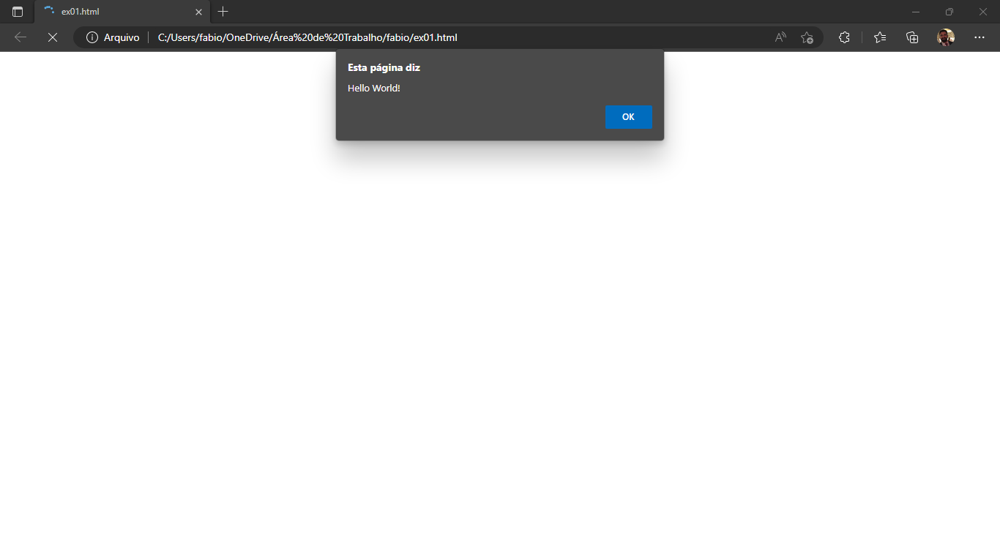
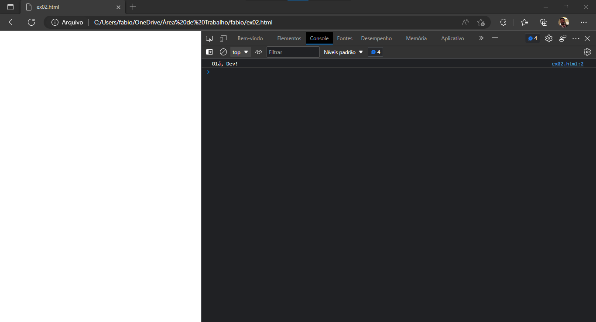
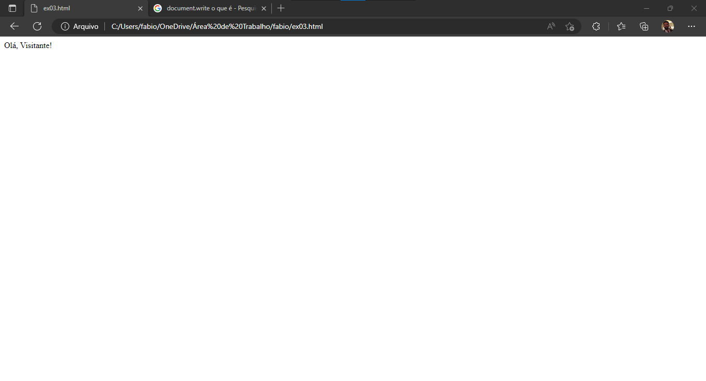

### [**Voltar para o Início**](../../README.md)

#### [**Página Anterior**](../02_01_arquivo_html_js/README.md)

***Requisitos para estar aqui:***
- Ter entendido a relação entre os diferentes tipos de arquivo que serão trabalhados!
- Caso não tenha feito, [**CLIQUE AQUI**.](../../02_variaveis_e_operadores/02_01_arquivo_html_js/README.md)
  
# <u>**VARIÁVEIS E OPERADORES**</u>

## **SAÍDA DE DADOS**

<u>Hello, Dev!</u>

Vamos utilizar algumas formas diferentes de apresentar uma mensagem para o usuário. Elas serão:
- alert()
- console.log()
- document.write()

Antes de começarmos, vamos adotar um padrão para os arquivos criaremos nas aulas.

Para já, crie o arquivo ***<u>ex01.html</u>***. Neste arquivo trabalharemos apenas uma das formas de apresentar dados, que é utilizando o _alert()_.

> Procure criar todos os arquivos na mesma pasta, pois dessa forma você conseguirá notar a sua evolução em Lógica de Programação voltando nos arquivos anteriores.

### **<u>alert()</u>**

Este comando (ou método) fará com que o browser apresente uma mensagem de alerta, que desabilitará as demais funções até que o usuário feche a mensagem apresentada.

Copie e cole o seguinte código no seu arquivo **ex01.html**:
```javascript
<script>
    alert("Hello World!");
</script>
```

Após, siga as seguintes etapas:
- Clique com o botão direito no arquivo **ex01.html**
- Selecione a opção "Revelar no explorador de arquivos"
- Dê dois cliques no arquivo **ex01.html**

Veja o resultado que o seu browser apresentará! Deverá ser algo exatamente como na imagem abaixo.



O código que colocamos faz com que o comando alert receba um texto para ser emitido como alerta para o visitante. O texto de alerta foi determinado pelo conteúdo que colocamos dentro do parênteses. Neste caso, como o alerta foi um texto fixo, determinado no próprio comando alert, utilizamos as aspas duplas -> " "

Também é possível que utilizemos as aspas simples. Neste caso, o código será:
```javascript
<script>
    alert('Hello World!');
</script>
```

Contudo, o **mais recomendado** é que, ao invés das aspas, utilizemos a crase \` ` para determinar o texto. Adiante entenderemos o motivo.
> *Spoiler: é uma forma moderna de realizar concatenações.*

Usando a crase, o código então será:
```javascript
<script>
    alert(`Hello World!`);
</script>
```

Em todos os formatos, o resultado será o mesmo do apresentado na figura com a mensagem de alerta.

Como saída de dados, porém com utilidade para o desenvolvedor, podemos utilizar outro comando, o _console.log()_.

### **<u>console.log()</u>**

Crie um novo arquivo, com o nome **ex02.html**. O código que será colocado neste arquivo é o:
```javascript
<script>
    console.log(`Olá, Dev!`);
</script>
```

Após, refaça as etapas para visualizar o arquivo **ex02.html**.
- Clique com o botão direito no arquivo **ex02.html**
- Selecione a opção "Revelar no explorador de arquivos"
- Dê dois cliques no arquivo **ex02.html**

Veja que o seu browser não apresentará nenhuma mensagem para o visitante da aplicação Web. Porém, para ver o que realmente aconteceu, siga as seguintes etapas:
- Na área branca do site, clique com o botão direito do mouse
- Selecione a opção disponível no seu browser, no que respeita a "Inspecionar"
- Vá na opção "Console"

Viu que a mensagem apareceu no Console do browser? O Console é muito utilizado pelos programadores para acompanhar a execução do código na realização de testes, por exemplo. Mas não se limita a isso. Vocês verão muitas outras utilidades para o Console no decorrer do curso.

A imagem abaixo demonstra o resultado do código que desenvolvemos.



> Um ponto importante a ser observado é o que há ao lado do texto "Olá, Dev!", bem na margem direita. O texto é o <u>ex02.html:2</u>. Isso significa que a mensagem que está ali sendo visualizada é proveniente do que foi desenvolvido no arquivo **ex02.html**, especificamente na **linha 2**.

E agora, por último mas não menos importante, _document.write()_.

### <u>**document.write()**</u>

O método document.write() também é um recurso JavaScript, que nos permite escrever em um documento. Neste caso, escreverá o conteúdo que definirmos em um documento HTML.

Novamente, crie um novo arquivo, agora chamado **ex03.html**.

Neste arquivo, o código que deverá conter será o:
```javascript
<script>
    document.write(`Olá, Visitante!`);
</script>
```

Repita as mesmas etapas para abrir o arquivo no browser (clique com o botão direito, vá no revelar no explorador de arquivos, dê duplo clique no arquivo **ex03.html**...) e veja qual é o resultado apresentado.

Deverá ser algo semelhante ao da figura abaixo.



Vejam aqui uma nova forma de saída de dados, para apresentar ao usuário a mensagem necessária.

#

Note que, até então, não houve qualquer interação do usuário com a aplicação. Apenas apresentamos dados, informações, mensagens determinadas por nós mesmos. Isso se deve a não termos ainda estudado de que forma o usuário interagirá com a aplicação, porém é a nossa próxima etapa, por meio da entrada de dados.

### [<u>**Próxima Etapa: Entrada de Dados!**</u>](../02_03_entrada_de_dados/README.md)