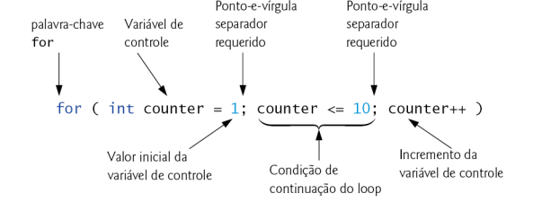
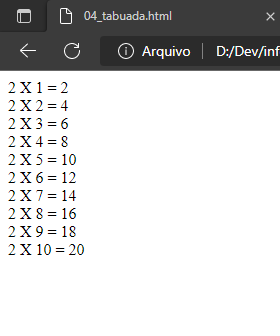
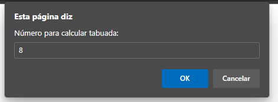
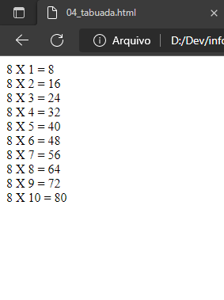

# Repetição com variável de controle
## Laços de repetição com For

Ao invés de utilizarmos o ***for of*** limitado ao número de itens que possuem em uma lista, podemos determinar a quantidade de vezes que o nosso for repetirá as instruções que programarmos.

Para esse fim, o ***for*** será composto por três instruções, que são:
* O valor inicial da variável que controlará a quantidade de repetições das instruções do programa;
* A condição que determina se a repetição deve ou não continuar;
* O incremento ou decremento da variável de controle.

    *Dica: Considere que você precisa adicionar valor para uma let, e este valor será incrementado para o próximo número em um valor. Ou seja, a let número vale 1 e você deseja que ela valha 2. Para fazer isso, você tem algumas formas distintas:*
    ```javascript
    let numero = 1; //Valor inicial da let numero
    numero = numero + 1; //Agora a número valerá 2
    numero += 1 //Agora a número valerá 3
    numero ++ //Ou numero++, que atribuirá valor 4 para a let número
    ```
    *Todas as formas acima adicionarão um valor acima para a let numero.*

Então, em uma estrutura de repetição em que você deseja controlar a quantidade de vezes que as instruções serão repetidas, o for deverá ser da seguinte forma:
```javascript
for (let contador = 1; contador <= 5; contador++) {
    alert(contador);
}
```
   *As instruções que você colocar entre as chaves { } serão as instruções que você deseja repetir.*

No exemplo acima, definimos a *let contador* para que ela determinasse a quantidade de vezes que a instrução que está dentro do *for* fosse executada. O resultado será um programa que apresentará um alerta cinco vezes, começando com o valor ***1*** no alerta na primeira vez. Na segunda vez, o alerta apresenta o valor ***2***, na terceira vez o valor ***3***, na quarta vez o valor ***4*** e na quinta vez o valor ***5***.

Temos a possibilidade de atribuir um valor diferente para a *let contador*, por exemplo. Caso deseja que o alerta seja exibido a partir do valor 3, por exemplo, basta mudar o código para que a estrutura de repetição comece já com o valor 3 na let contador.
```javascript
for (let contador = 3; contador <= 5; contador++) {
    alert(contador);
}
```
Assim, o alerta começa apresentando o valor ***3***, posteriormente o valor ***4*** e, por último, o valor ***5***.

Outra possibilidade, caso exista essa demanda, é incrementar valores diferentes para a *let contador*. Digamos que você quer incrementar de dois em dois valores, iniciando do 1 e indo para o 5. Considere o exemplo abaixo.
```javascript
for (let contador = 1; contador <= 5; contador+=2) {
    alert(contador);
}
```

A imagem abaixo explica, com mais detalhes, cada elemento da sintaxe do ***for*** com variável de controle.




Em um outro exemplo clássico de utilização do ***for*** com variável de controle, considere calcular a tabuada.

Para calcular a tabuada de 2, por exemplo, será necessário o seguinte código em JavaScript:
```javascript
for (let contador = 1; contador <= 10; contador++) {
    document.write(`2 x ${contador} = ${contador * 2}</br>`);
}
```
   *A tag br colocada ao final da instrução document.write servirá para quebrar linha após apresentar o cálculo respectivo com a instrução executada pelo programa.*

Assim, o resultado que será escrito na tela será:



Contudo, caso queira deixar que o usuário insira o número que deseja calcular a tabuada, não sendo apenas a tabuada de 2, o código será o seguinte:
```javascript
let numeroUsuario = Number(prompt("Número para calcular tabuada:"))
    for (let contador = 1; contador <= 10; contador++) {
        document.write(`${numeroUsuario} x ${contador} = ${contador * numeroUsuario}</br>`)
    }
```
Inicialmente, o programa perguntará para o usuário qual o número que deseja calcular a tabuada, que é o nosso já conhecido prompt.



Assim, o resultado da tabuada, conforme solicitado pelo usuário, será o apresentado na imagem abaixo.



# IMPORTANTE!!!

Todo o conteúdo que já trabalhamos até aqui na disciplina de Programação será aplicado ao trabalharmos com estruturas de repetição.
Os temas que aparecerão aqui repetidamente são:
* if... else (e if... else aninhado)
* operador ternário (e operador ternário aninhado)
* switch... case
* variáveis e operadores (muitas operações matemáticas!)
* e, principalmente, [**Arrays!!**](https://github.com/ldmfabio/1INFOs-vetores)

##### Alguns links para estudos complementares

* [Developer.mozilla - for](https://developer.mozilla.org/pt-BR/docs/Web/JavaScript/Reference/Statements/for)
* [W3Schools - JavaScript For Loop](https://www.w3schools.com/js/js_loop_for.asp)
* [DevMedia - For em Javascript - Dica](https://www.devmedia.com.br/for-em-javascript-dica/28554)

##### Vídeos de apoio
* [Código Fonte TV](https://youtu.be/NfHVPEzo5Ik)
* [Brazilian Dev](https://www.youtube.com/watch?v=HJcZKxd-Uas)

##### Dúvidas da comunidade sobre ***for***
* [Stack Overflow - Loop JavaScript for (...)](https://pt.stackoverflow.com/questions/403105/loop-javascript-for)