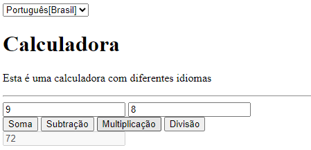
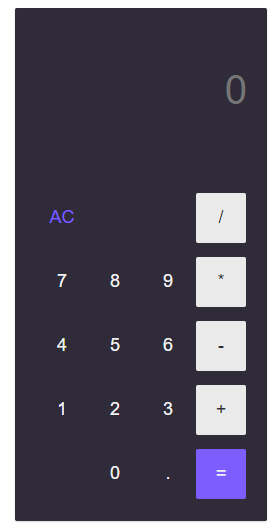
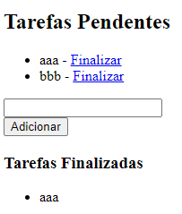

### [**Voltar para o Início**](../../README.md)

#### [**Página Anterior**](../07_objetos/README.md)

***Requisitos para estar aqui:***
- Ter finalizado a Lista de Exercícios sobre Objetos em JavaScript!
- Caso ainda não tenha finalizado, [**CLIQUE AQUI**.](../07_objetos/listaExercicios_01/README.md)

# Desafios - Programação I

## Desafio 01: Calculadora com diferentes idiomas
Crie uma aplicação Web que possibilite o usuário traduzir todo o texto que aparece na tela para diferentes idiomas. A aplicação deve ter as quatro operações, e o usuário deve poder escolher o idioma em que deseja ver o texto. 

Entre os idiomas, tente incluir o Português, Inglês, Espanhol e Francês.

Dica: Use objetos para armazenar as traduções.

Como sugestão, siga a imagem abaixo:

## Desafio 02: Calculadora

Crie uma aplicação Web que tenha todas as funções de uma Calculadora **COMPLETA!**

Como sugestão, siga a imagem abaixo:

## Desafio 03: Lista de Tarefas

Crie uma aplicação Web que possibilite gerenciar tarefas pendentes, permitindo que o usuário finalize as tarefas e elas sejam removidas da lista de tarefas pendentes, sendo alocadas em uma lista de tarefas finalizadas. Também deve ser possível colocar as tarefas novamente como pendentes, caso o usuário deseje, além de também poder ser excluída, tanto da lista de tarefas pendentes quanto da lista de tarefas finalizadas.

Como sugestão, siga a imagem abaixo:

# <u>**BOA SORTE!**</u> 🍀